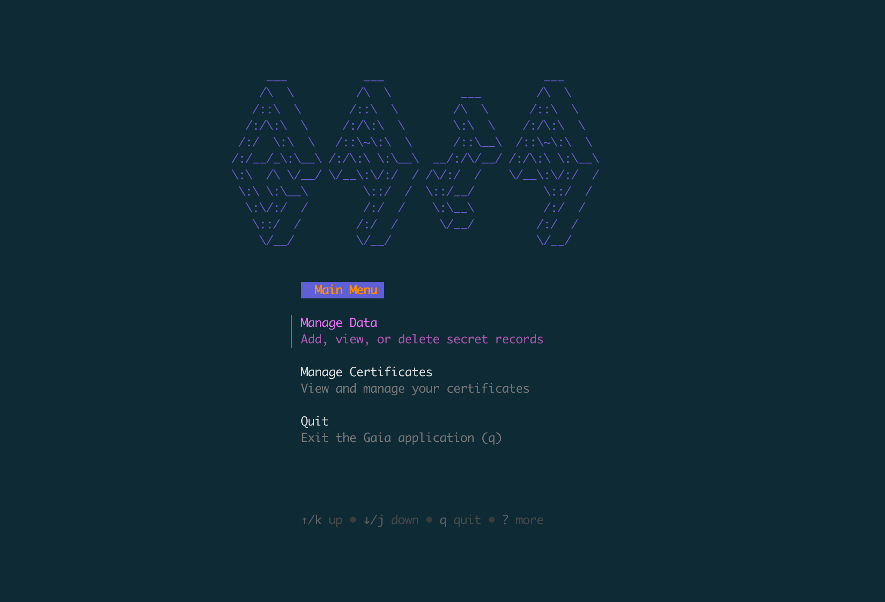

<h1>
    
    <span>Gaia: Self-Hosted Secrets Management</span>
</h1>
Gaia is a lightweight and secure secrets management daemon designed for developers and small teams. It provides a simple, gRPC-based API for storing, retrieving, and managing sensitive information like API keys, database credentials, and certificates.

With first-class support for Go applications and a powerful terminal user interface (TUI), Gaia makes it easy to centralize your secrets and decouple them from your application code.



## Core Concepts

*   **Encrypted at Rest**: All secrets are encrypted using AES-GCM before being written to a local BoltDB database.
*   **Master Passphrase**: The entire database is protected by a single master passphrase, which is used to derive the encryption key. The daemon is "locked" on startup and must be "unlocked" with the passphrase before it can serve secrets.
*   **Client-Specific Namespaces**: Secrets are organized by client and namespace, providing a logical way to isolate secrets for different applications or environments.
*   **mTLS Authentication**: All communication between the Gaia daemon and its clients is secured using mutual TLS (mTLS), ensuring that only trusted clients can access the API.
*   **Environment Injection**: A Go client library is provided to automatically fetch secrets and inject them into your application's environment, making it a seamless replacement for `.env` files.

## Features

*   **Secure Storage**: Industry-standard AES-GCM encryption for all secrets.
*   **Simple gRPC API**: A clear, strongly typed API for all interactions.
*   **Terminal UI (TUI)**: An intuitive, terminal-based user interface for easy management of secrets, clients, and namespaces.
*   **Go Client Library**: A ready-to-use Go library for easy integration with your applications.
*   **Cross-Platform**: The Gaia daemon and CLI can be compiled for Linux, macOS, and Windows.
*   **Systemd Support**: A pre-configured Systemd service file is provided for running Gaia as a background service on Linux.

## Getting Started

There are two main ways to interact with Gaia: as a **user/administrator** managing the service and its secrets, or as a **developer** integrating the client library into an application.

### For Administrators: Setting Up the Gaia Daemon

Follow these steps to set up and run the Gaia daemon on a Linux server.

#### 1. Installation

First, compile the `gaia` binary and place it in a standard location on your server.

```sh
# From your local machine (assuming you have the binary)
scp /path/to/your/gaia-linux-amd64 gaia-server:/tmp/gaia

# On the server
sudo mv /tmp/gaia /usr/local/bin/gaia
sudo chmod +x /usr/local/bin/gaia
```

#### 2. Create User and Directories

It is a security best practice to run the daemon as a dedicated, unprivileged user.

```sh
# Create a dedicated user and group for the gaia service
sudo groupadd --system gaia
sudo useradd --system --gid gaia --no-create-home --shell /bin/false gaia

# Create the configuration and data directories
sudo mkdir -p /etc/gaia/certs
sudo mkdir -p /var/lib/gaia

# Set the correct ownership
sudo chown -R gaia:gaia /etc/gaia
sudo chown -R gaia:gaia /var/lib/gaia
```

#### 3. Initial Configuration

Create a configuration file at `/etc/gaia/config.yaml`. This file will tell the daemon where to find its database and certificates.

```yaml
# /etc/gaia/config.yaml
grpc_port: "50051"
db_file: "/var/lib/gaia/gaia.db"
certs_directory: "/etc/gaia/certs"
cert_expiry_days: 365
```

#### 4. Generate Certificates and Initialize

Use the `gaia` CLI to generate the necessary TLS certificates and initialize the secure database.

```sh
# Generate the CA, server, and an initial admin client certificate
sudo -u gaia gaia certs generate --output-dir /etc/gaia/certs

# Initialize the database with your master passphrase
sudo -u gaia gaia init --db-file /var/lib/gaia/gaia.db
```

#### 5. Run as a Systemd Service

A Systemd service file is the most reliable way to run the daemon.

1.  **Create the service file:**
    ```sh
    sudo tee /etc/systemd/system/gaia.service > /dev/null <<'EOF'
    [Unit]
    Description=Gaia Secrets Management Daemon
    After=network.target

    [Service]
    User=gaia
    Group=gaia
    Type=simple
    ExecStart=/usr/local/bin/gaia daemon start --config /etc/gaia/config.yaml
    Restart=on-failure
    RestartSec=5s
    WorkingDirectory=/var/lib/gaia
    StandardOutput=journal
    StandardError=journal
    LimitNOFILE=65536

    [Install]
    WantedBy=multi-user.target
    EOF
    ```

2.  **Enable and start the service:**
    ```sh
    sudo systemctl daemon-reload
    sudo systemctl enable gaia.service
    sudo systemctl start gaia.service
    ```

You can now check the status and logs with `sudo systemctl status gaia` and `sudo journalctl -u gaia -f`.

### For Developers: Using the Go Client Library

The Go client library makes it easy to fetch secrets from Gaia.

#### 1. Installation

```sh
go get github.com/stain-win/gaia/libs/go@v1.0.0
```

#### 2. Initializing the Client

```go
import "github.com/stain-win/gaia/libs/go/client"

func main() {
    cfg := client.Config{
        Address:        "your-gaia-server.com:50051",
        CACertFile:     "/path/to/ca.crt",
        ClientCertFile: "/path/to/client.crt",
        ClientKeyFile:  "/path/to/client.key",
    }

    gaiaClient, err := client.NewClient(cfg)
    if err != nil {
        log.Fatalf("Failed to connect to Gaia: %v", err)
    }
    defer gaiaClient.Close()

    // ... use the client
}
```

#### 3. Loading Secrets into the Environment

The most powerful feature is the ability to replace `.env` files. Call `LoadEnv` at the start of your application to fetch all secrets from the "common" area and inject them as environment variables.

```go
func main() {
    // ... initialize gaiaClient

    if err := gaiaClient.LoadEnv(context.Background()); err != nil {
        log.Fatalf("Failed to load environment from Gaia: %v", err)
    }

    // Your application can now access the secrets as standard environment variables
    apiKey := os.Getenv("GAIA_API_KEYS_STRIPE_SECRET")
    dbPassword := os.Getenv("GAIA_DATABASE_POSTGRES_PASSWORD")
}
```

Environment variables are formatted as `GAIA_NAMESPACE_KEY`, all uppercase.

## Building from Source

To build Gaia yourself, you'll need Go and `protoc` installed.

```sh
# Clone the repository
git clone https://github.com/stain-win/gaia.git
cd gaia

# Build the main application binary
make build

# To build for all platforms
make cross-build
```

The compiled binaries will be available in the `bin/` directory.

## License

This project is licensed under the MIT License - see the LICENSE file for details.
