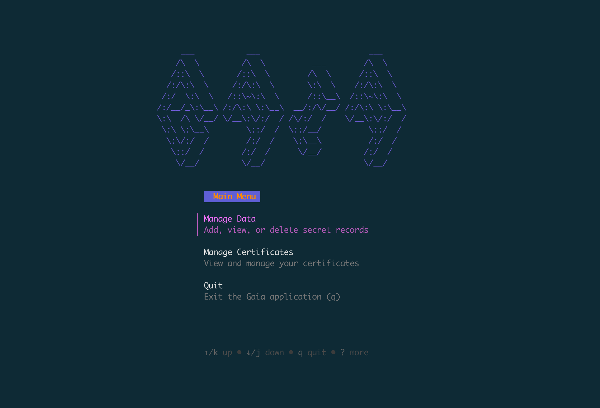

<h1>
    
    <span>Gaia: Self-Hosted Secrets Management</span>
</h1>

[](LICENSE)
[](https://go.dev)
[](https://nodejs.org)

Gaia is a **lightweight, secure, and self-hosted secrets management daemon** designed for developers and small teams. Think of it as a "toy version of HashiCorp Vault" with a carefully cherry-picked feature set that makes it easy and fun to use.

**Perfect for small web projects where Docker secrets are too simple and Vault is overkill.**

<p align="center">
  
</p>

---

## Table of Contents

- [Why Gaia?](#why-gaia)
- [Key Features](#key-features)
- [Core Concepts](#core-concepts)
- [Quick Start](#quick-start)
- [Installation](#installation)
- [Using the TUI (Terminal UI)](#using-the-tui-terminal-ui)
- [Client Libraries](#client-libraries)
  - [Go Client](#go-client)
  - [JavaScript/TypeScript Client](#javascripttypescript-client)
  - [Rust Client](#rust-client)
- [CLI Reference](#cli-reference)
  - [Daemon Management](#daemon-management)
  - [Initialization](#initialization)
  - [Certificate Management](#certificate-management)
  - [Client Management](#client-management)
  - [Policy Management](#policy-management)
  - [Secret Management](#secret-management)
  - [Bulk Import/Export](#bulk-importexport)
- [Audit Logging](#audit-logging)
- [Production Deployment](#production-deployment)
- [Architecture & Security](#architecture--security)
- [Building from Source](#building-from-source)
- [Contributing](#contributing)
- [License](#license)

---

## Why Gaia?

**The Problem:** You're building a small web application and need to manage secrets (API keys, database passwords, certificates). What do you use?

- **Environment variables?** Not secure, hard to rotate, scattered across servers
- **`.env` files?** Even worse - often committed to git by accident
- **HashiCorp Vault?** Overkill for a small team, complex setup, high resource usage
- **Docker secrets?** Limited functionality, tight Docker coupling

**The Solution:** Gaia provides a secure, self-hosted middle ground:

✅ **Simple to set up** - Single binary, one command to start  
✅ **Secure by default** - AES-256-GCM encryption, mTLS authentication  
✅ **Easy to use** - Beautiful TUI, simple CLI, clean API  
✅ **Developer-friendly** - Client libraries for Go, Node.js, and Rust  
✅ **Self-hosted** - Your secrets stay on your infrastructure  
✅ **Lightweight** - Minimal resource usage, perfect for small VPS  
✅ **Backup & Migration** - Built-in import/export for easy backups and migrations  

---

## Key Features

### 🔒 Security First

- **AES-256-GCM Encryption** - All secrets encrypted at rest
- **Master Passphrase** - Single passphrase protects entire database
- **mTLS Authentication** - Only trusted clients can connect
- **Locked/Unlocked State** - Daemon starts locked, must be unlocked to serve secrets
- **Scrypt Key Derivation** - Industry-standard password hashing

### 🎨 Beautiful Interface

- **Interactive TUI** - Manage secrets, clients, and certificates visually
- **Real-time Status** - See daemon status (locked/unlocked/offline) at a glance
- **Easy Navigation** - Intuitive keyboard shortcuts
- **State-Aware Menus** - Options adapt based on daemon state

### 🚀 Developer Experience

- **Go Client Library** - First-class Go support
- **JavaScript/TypeScript Client** - Full-featured npm package
- **Rust Client Library** - High-performance async Rust support
- **Environment Injection** - Replace `.env` files seamlessly
- **Simple gRPC API** - Clean, strongly-typed interface
- **Multiple Namespaces** - Organize secrets logically

### 🛠️ Operations

- **Systemd Support** - Run as a system service
- **Audit Logging** - Track all secret access
- **Cross-Platform** - Linux, macOS, Windows support
- **Bulk Import/Export** - Backup, migrate, and clone environments
- **Easy Backup** - Single encrypted database file
- **Certificate Management** - Built-in mTLS cert generation
- **Easy Backup** - Single encrypted database file
- **Certificate Management** - Built-in mTLS cert generation

---

## Core Concepts

### Architecture

Gaia uses a **client-server architecture**:

```
┌─────────────┐         mTLS/gRPC          ┌──────────────┐
│             │  ───────────────────────>  │              │
│  Your App   │                            │ Gaia Daemon  │
│  (Client)   │  <───────────────────────  │   (Server)   │
│             │      Encrypted Secrets     │              │
└─────────────┘                            └──────────────┘
                                                   │
                                                   │
                                            ┌──────▼──────┐
                                            │   BoltDB    │
                                            │  (AES-GCM)  │
                                            └─────────────┘
```

### Data Organization

Secrets are organized in a **three-level hierarchy**:

```
Client
  └─ Namespace
      └─ Secret (key-value pair)
```

**Example:**
```
web-app-production
  ├─ database
  │   ├─ url: postgres://...
  │   └─ password: ******
  └─ api-keys
      ├─ stripe: sk_live_...
      └─ sendgrid: SG.***
```

### Special "Common" Namespace

The **common** namespace is accessible by all clients:

```
common (reserved)
  ├─ production
  │   ├─ database_url: postgres://...
  │   └─ api_key: ******
  └─ staging
      └─ api_key: ******
```

This is perfect for shared configuration that all applications need.

### Lock/Unlock State

The daemon operates in two states:

- **🔒 Locked** - Database encrypted, secrets inaccessible, master key not in memory
- **🔓 Unlocked** - Secrets can be read/written, master key in memory

This design minimizes the window for memory-scraping attacks.

---

## Quick Start

### 1. Install Gaia

```bash
# Download the latest release (Linux amd64)
VERSION=$(curl -s https://api.github.com/repos/stain-win/gaia/releases/latest | grep tag_name | cut -d '"' -f 4)
wget https://github.com/stain-win/gaia/releases/download/${VERSION}/gaia_${VERSION}_Linux_x86_64.tar.gz

# Extract and install
tar -xzf gaia_${VERSION}_Linux_x86_64.tar.gz
chmod +x gaia
sudo mv gaia /usr/local/bin/

# Verify installation
gaia version
```

For other platforms, see the [Installation](#installation) section.

### 2. Initialize

```bash
# Create certificates
gaia certs generate --output-dir ./certs

# Initialize the encrypted database
gaia init
# Enter your master passphrase when prompted
```

### 3. Start the Daemon

```bash
# Start in foreground (for testing)
gaia daemon start

# Or run in background
gaia daemon start &
```

### 4. Use the TUI

```bash
# Launch the interactive interface
gaia

# Or if you installed it as just 'gaia', it starts TUI by default
gaia
```

### 5. Unlock and Add Secrets

In the TUI:
1. Select **"Unlock Gaia"** and enter your passphrase
2. Go to **"Manage Data"** → **"Add New Record"**
3. Add your first secret!

---

## Installation

### Pre-built Binaries

Download from the [releases page](https://github.com/stain-win/gaia/releases).

#### Linux (amd64)

```bash
# Download the latest version
VERSION=$(curl -s https://api.github.com/repos/stain-win/gaia/releases/latest | grep tag_name | cut -d '"' -f 4)
wget https://github.com/stain-win/gaia/releases/download/${VERSION}/gaia_${VERSION}_Linux_x86_64.tar.gz

# Extract
tar -xzf gaia_${VERSION}_Linux_x86_64.tar.gz

# Install
chmod +x gaia
sudo mv gaia /usr/local/bin/

# Verify
gaia version
```

#### Linux (arm64)

```bash
# Download the latest version
VERSION=$(curl -s https://api.github.com/repos/stain-win/gaia/releases/latest | grep tag_name | cut -d '"' -f 4)
wget https://github.com/stain-win/gaia/releases/download/${VERSION}/gaia_${VERSION}_Linux_arm64.tar.gz

# Extract and install
tar -xzf gaia_${VERSION}_Linux_arm64.tar.gz
chmod +x gaia
sudo mv gaia /usr/local/bin/
```

#### macOS (Apple Silicon - M1/M2/M3)

```bash
# Download the latest version
VERSION=$(curl -s https://api.github.com/repos/stain-win/gaia/releases/latest | grep tag_name | cut -d '"' -f 4)
curl -LO https://github.com/stain-win/gaia/releases/download/${VERSION}/gaia_${VERSION}_Darwin_arm64.tar.gz

# Extract and install
tar -xzf gaia_${VERSION}_Darwin_arm64.tar.gz
chmod +x gaia
sudo mv gaia /usr/local/bin/
```

#### macOS (Intel)

```bash
# Download the latest version
VERSION=$(curl -s https://api.github.com/repos/stain-win/gaia/releases/latest | grep tag_name | cut -d '"' -f 4)
curl -LO https://github.com/stain-win/gaia/releases/download/${VERSION}/gaia_${VERSION}_Darwin_x86_64.tar.gz

# Extract and install
tar -xzf gaia_${VERSION}_Darwin_x86_64.tar.gz
chmod +x gaia
sudo mv gaia /usr/local/bin/
```

#### Windows (amd64)

Download the `.zip` file from the [releases page](https://github.com/stain-win/gaia/releases/latest) and extract it to a directory in your PATH.

Or using PowerShell:

```powershell
# Get latest version
$VERSION = (Invoke-RestMethod -Uri "https://api.github.com/repos/stain-win/gaia/releases/latest").tag_name

# Download
Invoke-WebRequest -Uri "https://github.com/stain-win/gaia/releases/download/$VERSION/gaia_${VERSION}_Windows_x86_64.zip" -OutFile "gaia.zip"

# Extract
Expand-Archive -Path gaia.zip -DestinationPath .

# Move to a directory in your PATH
Move-Item gaia.exe C:\Windows\System32\
```

#### Verifying Downloads

All releases include checksums. Verify your download:

```bash
# Download checksums
wget https://github.com/stain-win/gaia/releases/download/${VERSION}/checksums.txt

# Verify (Linux/macOS)
sha256sum -c checksums.txt 2>&1 | grep gaia

# Or verify specific file
sha256sum gaia_${VERSION}_Linux_x86_64.tar.gz
```

### From Source

```bash
# Prerequisites: Go 1.21+, protoc
git clone https://github.com/stain-win/gaia.git
cd gaia

# Build
make build

# Binary will be in ./bin/gaia
sudo cp bin/gaia /usr/local/bin/
```

### Verify Installation

```bash
gaia version
```

---

## Using the TUI (Terminal UI)

The **Terminal User Interface (TUI)** is the easiest way to manage Gaia.

### Launching

```bash
# Just run gaia (default command is TUI)
gaia
```

### Features

#### Main Menu

- **Unlock Gaia** - Unlock the daemon with your passphrase (when locked)
- **Manage Data** - Add, view, and manage secrets
- **Manage Certificates** - Create and register client certificates
- **Quit** - Exit the TUI

#### Status Bar

The top status bar shows:
- **Daemon Status** - 🔓 unlocked, 🔒 locked, or ⚠️ offline
- **Status Messages** - Operation results and notifications

#### Data Management

- **Add New Record** - Create a new secret
  - Select client and namespace
  - Enter key and value
  - Secrets are encrypted immediately
  
- **List All Records** - Browse all secrets
  - Navigate by client and namespace
  - View secret values (masked by default)
  - Organized table view

#### Certificate Management

- **Register Client** - Create a new client with certificates
  - Generates mTLS certificate pair
  - Registers client in database
  - Certificates saved to disk

#### Keyboard Shortcuts

- **↑/↓** - Navigate menu items
- **Enter** - Select option
- **b** - Go back (most screens)
- **Esc** - Cancel/go back (forms)
- **q** - Quit application
- **Ctrl+C** - Force quit

#### State-Aware Behavior

The TUI adapts to daemon state:

**When Locked 🔒:**
- "Unlock Gaia" option appears first
- "Manage Data" disabled with warning
- Attempting data access shows: "⚠️ Cannot access data - Gaia is locked"

**When Unlocked 🔓:**
- "Unlock Gaia" option hidden
- All data operations available
- Full functionality

**When Offline ⚠️:**
- Shows "(Offline)" indicators
- Data operations blocked
- Clear message to start daemon

---

## Client Libraries

### Go Client

#### Installation

```bash
go get github.com/stain-win/gaia/libs/go/client
```

#### Basic Usage

```go
package main

import (
    "context"
    "log"
    "os"
    
    "github.com/stain-win/gaia/libs/go/client"
)

func main() {
    // Configure client
    cfg := client.Config{
        Address:        "localhost:50051",
        CACertFile:     "./certs/ca.crt",
        ClientCertFile: "./certs/client.crt",
        ClientKeyFile:  "./certs/client.key",
    }

    // Connect
    gaiaClient, err := client.NewClient(cfg)
    if err != nil {
        log.Fatalf("Failed to connect: %v", err)
    }
    defer gaiaClient.Close()

    // Fetch a single secret
    secret, err := gaiaClient.GetSecret(context.Background(), "production", "api_key")
    if err != nil {
        log.Fatalf("Failed to get secret: %v", err)
    }
    log.Printf("API Key: %s", secret)
}
```

#### Load Environment Variables

Replace your `.env` files:

```go
func main() {
    gaiaClient, _ := client.NewClient(cfg)
    defer gaiaClient.Close()

    // Load ALL secrets from common namespace into environment
    if err := gaiaClient.LoadEnv(context.Background()); err != nil {
        log.Fatalf("Failed to load environment: %v", err)
    }

    // Now use standard environment variables
    dbURL := os.Getenv("GAIA_PRODUCTION_DATABASE_URL")
    apiKey := os.Getenv("GAIA_PRODUCTION_API_KEY")
    
    // Your app continues normally...
}
```

Environment variables are formatted as: `GAIA_NAMESPACE_KEY` (uppercase, hyphens → underscores)

#### API Reference

```go
// Connect to Gaia daemon
func NewClient(cfg Config) (*Client, error)

// Get a single secret
func (c *Client) GetSecret(ctx context.Context, namespace, id string) (string, error)

// Get all secrets from common area
func (c *Client) GetCommonSecrets(ctx context.Context, namespace ...string) (map[string]map[string]string, error)

// Load secrets into environment
func (c *Client) LoadEnv(ctx context.Context) error

// Check daemon status
func (c *Client) GetStatus(ctx context.Context) (string, error)

// List available namespaces
func (c *Client) GetNamespaces(ctx context.Context) ([]string, error)

// Close connection
func (c *Client) Close() error
```

### JavaScript/TypeScript Client

#### Installation

```bash
npm install @stain-win/gaia
```

#### Basic Usage (TypeScript)

```typescript
import { createClient } from '@stain-win/gaia-client';

async function main() {
  // Connect to Gaia
  const client = await createClient({
    address: 'localhost:50051',
    caCertFile: './certs/ca.crt',
    clientCertFile: './certs/client.crt',
    clientKeyFile: './certs/client.key'
  });

  try {
    // Fetch a secret
    const apiKey = await client.getSecret('production', 'api_key');
    console.log('API Key:', apiKey);

    // Get all common secrets
    const secrets = await client.getCommonSecrets();
    console.log('Secrets:', secrets);

  } finally {
    await client.close();
  }
}

main();
```

#### Load Environment Variables

```typescript
import { createClient } from '@stain-win/gaia-client';

const client = await createClient({ /* config */ });

// Load all secrets into process.env
await client.loadEnv();

// Access as environment variables
const dbUrl = process.env.GAIA_PRODUCTION_DATABASE_URL;
const apiKey = process.env.GAIA_PRODUCTION_API_KEY;
```

#### Express.js Integration

```typescript
import express from 'express';
import { createClient } from '@stain-win/gaia-client';

const app = express();

// Initialize Gaia client on startup
const gaiaClient = await createClient({
  address: process.env.GAIA_ADDRESS || 'localhost:50051',
  caCertFile: './certs/ca.crt',
  clientCertFile: './certs/client.crt',
  clientKeyFile: './certs/client.key'
});

// Load secrets
await gaiaClient.loadEnv();

// Use in routes
app.get('/api/data', async (req, res) => {
  const dbUrl = process.env.GAIA_PRODUCTION_DATABASE_URL;
  // ... use the secret
});

// Cleanup on shutdown
process.on('SIGTERM', async () => {
  await gaiaClient.close();
  process.exit(0);
});

app.listen(3000);
```

#### API Reference

```typescript
// Create and connect client
async function createClient(config: GaiaClientConfig): Promise<GaiaClient>

class GaiaClient {
  // Connect to daemon
  async connect(): Promise<void>
  
  // Get a single secret
  async getSecret(namespace: string, id: string): Promise<string>
  
  // Get common secrets (all or specific namespace)
  async getCommonSecrets(namespace?: string): Promise<SecretsMap>
  
  // Load secrets into process.env
  async loadEnv(): Promise<void>
  
  // Check daemon status
  async getStatus(): Promise<string>
  
  // List namespaces
  async getNamespaces(): Promise<string[]>
  
  // Close connection
  async close(): Promise<void>
}
```

#### Configuration

```typescript
interface GaiaClientConfig {
  address: string;              // Required: "localhost:50051"
  caCertFile?: string;         // Required for mTLS
  clientCertFile?: string;     // Required for mTLS
  clientKeyFile?: string;      // Required for mTLS
  timeout?: number;            // Optional: default 5000ms
  insecure?: boolean;          // Optional: dev only, default false
}
```

---

### Rust Client

#### Installation

Add to your `Cargo.toml`:

```toml
[dependencies]
gaia-client = "0.1"
tokio = { version = "1.0", features = ["full"] }
```

#### Basic Usage

```rust
use gaia_client::{GaiaClient, GaiaClientConfig};

#[tokio::main]
async fn main() -> Result<(), Box<dyn std::error::Error>> {
    // Configure client
    let config = GaiaClientConfig::new(
        "localhost:50051",
        "/etc/gaia/certs/ca.crt",
        "/etc/gaia/certs/client.crt",
        "/etc/gaia/certs/client.key",
    );

    // Connect to Gaia daemon
    let mut client = GaiaClient::connect(config).await?;

    // Check if daemon is ready
    if !client.is_unlocked().await? {
        eprintln!("Daemon is locked. Please unlock it first.");
        return Ok(());
    }

    // Fetch a secret
    let secret = client.get_secret("production", "database_url").await?;
    println!("Database URL: {}", secret.value);

    // Get all common secrets
    let common_secrets = client.get_common_secrets(None).await?;
    for namespace in common_secrets {
        println!("Namespace: {}", namespace.name);
        for secret in namespace.secrets {
            println!("  {}: {}", secret.id, secret.value);
        }
    }

    Ok(())
}
```

#### Configuration from Environment

```rust
use gaia_client::GaiaClientConfig;

// Reads from environment variables:
// - GAIA_SERVER_ADDRESS (default: "localhost:50051")
// - GAIA_CA_CERT (default: "/etc/gaia/certs/ca.crt")
// - GAIA_CLIENT_CERT (default: "/etc/gaia/certs/client.crt")
// - GAIA_CLIENT_KEY (default: "/etc/gaia/certs/client.key")
let config = GaiaClientConfig::from_env();

let mut client = GaiaClient::connect(config).await?;
```

#### Error Handling

```rust
use gaia_client::GaiaError;

match client.get_secret("production", "api_key").await {
    Ok(secret) => println!("API Key: {}", secret.value),
    Err(GaiaError::DaemonLocked) => {
        eprintln!("Daemon is locked. Unlock it first.");
    }
    Err(GaiaError::SecretNotFound(ns, id)) => {
        eprintln!("Secret {}/{} not found", ns, id);
    }
    Err(GaiaError::DaemonOffline) => {
        eprintln!("Daemon is offline. Start it first.");
    }
    Err(e) => {
        eprintln!("Error: {}", e);
    }
}
```

#### API Reference

```rust
// Connect to Gaia daemon
pub async fn connect(config: GaiaClientConfig) -> Result<GaiaClient>

// Get daemon status
pub async fn get_status(&mut self) -> Result<StatusResponse>

// Check if daemon is unlocked
pub async fn is_unlocked(&mut self) -> Result<bool>

// Get a single secret
pub async fn get_secret(&mut self, namespace: &str, id: &str) -> Result<Secret>

// List all namespaces
pub async fn get_namespaces(&mut self) -> Result<NamespaceResponse>

// Get all common secrets (optionally filtered by namespace)
pub async fn get_common_secrets(&mut self, namespace: Option<String>) -> Result<Vec<Namespace>>

// Get secrets from a specific common namespace
pub async fn get_common_namespace_secrets(&mut self, namespace: &str) -> Result<Vec<Secret>>
```

#### Actix Web Integration

```rust
use actix_web::{web, App, HttpServer};
use gaia_client::{GaiaClient, GaiaClientConfig};
use std::sync::Mutex;

struct AppState {
    gaia_client: Mutex<GaiaClient>,
}

#[actix_web::main]
async fn main() -> std::io::Result<()> {
    // Initialize Gaia client
    let config = GaiaClientConfig::from_env();
    let gaia_client = GaiaClient::connect(config).await
        .expect("Failed to connect to Gaia");

    let app_state = web::Data::new(AppState {
        gaia_client: Mutex::new(gaia_client),
    });

    HttpServer::new(move || {
        App::new()
            .app_data(app_state.clone())
            .route("/api/secret", web::get().to(get_secret))
    })
    .bind(("127.0.0.1", 8080))?
    .run()
    .await
}

async fn get_secret(state: web::Data<AppState>) -> String {
    let mut client = state.gaia_client.lock().unwrap();
    match client.get_secret("production", "api_key").await {
        Ok(secret) => secret.value,
        Err(e) => format!("Error: {}", e),
    }
}
```

---

## CLI Reference

### Daemon Management

```bash
# Start daemon (foreground)
gaia daemon start

# Start with custom config
gaia daemon start --config /etc/gaia/config.yaml

# Check daemon status
gaia daemon status

# Lock daemon
gaia daemon lock

# Unlock daemon
gaia daemon unlock
# Enter passphrase when prompted

# Stop daemon
gaia daemon stop
```

### Initialization

```bash
# Initialize database (first time)
gaia init

# Initialize with custom path
gaia init --db-file /var/lib/gaia/gaia.db
```

### Certificate Management

```bash
# Generate CA, server, and client certificates
gaia certs generate --output-dir ./certs

# Generate only specific cert type
gaia certs generate-ca --output-dir ./certs
gaia certs generate-server --output-dir ./certs
gaia certs generate-client --name myapp --output-dir ./certs
```

### Client Management

```bash
# Register a new client
gaia clients register <client-name>

# List all clients
gaia clients list

# Remove a client
gaia clients remove <client-name>
```

### Policy Management

```bash
# List all policies
gaia policy list

# Get policy for a client
gaia policy get <client-name>

# Set policy from JSON file
gaia policy set <client-name> <policy-file>

# Delete a policy
gaia policy delete <client-name>

# Validate policy file
gaia policy validate <policy-file>
```

**Example Policy File:**
```json
{
  "client_name": "myapp",
  "rules": [
    {
      "path": "common/*",
      "capabilities": ["read", "list"],
      "description": "Read common secrets"
    },
    {
      "path": "myapp/*",
      "capabilities": ["read", "write", "delete", "list"],
      "description": "Full access to own namespace"
    }
  ]
}
```

See `examples/policy-*.json` for more policy examples.

### Secret Management

```bash
# Add a secret
gaia secrets add <client> <namespace> <key> <value>

# Example
gaia secrets add web-app production database_url "postgres://..."

# Get a secret
gaia secrets get <client> <namespace> <key>

# List secrets
gaia secrets list <client>

# Delete a secret
gaia secrets delete <client> <namespace> <key>
```

### Execute Commands with Secrets

The `gaia exec` command allows you to run any command with secrets automatically injected as environment variables. This is perfect for replacing `.env` files and ensuring secrets are never written to disk.

```bash
# Execute a command with secrets injected
gaia exec -- <command> [args...]

# Examples
gaia exec -- node server.js
gaia exec -- python app.py
gaia exec -- ./my-binary --flag value
gaia exec -- npm run start
```

**How It Works:**

1. Gaia fetches all secrets from the **common** namespace
2. Converts them to environment variables with the format: `GAIA_NAMESPACE_KEY`
3. Replaces the current process with your command

**Environment Variable Format:**

Common secrets are transformed into environment variables:

```
common/production/database_url  →  GAIA_PRODUCTION_DATABASE_URL
common/staging/api_key          →  GAIA_STAGING_API_KEY
common/third-party/stripe_key   →  GAIA_THIRD_PARTY_STRIPE_KEY
```

**Example Use Case:**

```bash
# Instead of using .env files:
# DATABASE_URL=postgres://...
# API_KEY=secret123
# node app.js

# Use gaia exec:
gaia secrets add common production database-url "postgres://..."
gaia secrets add common production api-key "secret123"
gaia exec -- node app.js

# Your app.js can now use:
# const dbUrl = process.env.GAIA_PRODUCTION_DATABASE_URL;
# const apiKey = process.env.GAIA_PRODUCTION_API_KEY;
```

**Benefits:**

✅ **No `.env` files** - Secrets never written to disk  
✅ **Automatic updates** - Changes reflected immediately  
✅ **Secure** - Uses mTLS authentication  
✅ **Simple** - Works with any command or script  
✅ **Audited** - All secret access logged  

**Integration Example (Node.js):**

```javascript
// app.js
const dbUrl = process.env.GAIA_PRODUCTION_DATABASE_URL;
const apiKey = process.env.GAIA_PRODUCTION_API_KEY;

if (!dbUrl || !apiKey) {
  console.error('Required secrets not found');
  process.exit(1);
}

// Use secrets...
```

Run with:
```bash
gaia exec -- node app.js
```

### Bulk Import/Export

```bash
# Export all secrets to JSON
gaia secrets export > backup.json

# Export all secrets to YAML
gaia secrets export --format yaml > backup.yaml

# Export secrets for a specific client
gaia secrets export --client myapp > myapp-secrets.json

# Export secrets from a specific namespace
gaia secrets export --client myapp --namespace production > prod-secrets.json

# Import secrets from a file
gaia secrets import backup.json

# Import with overwrite (update existing secrets)
gaia secrets import --overwrite backup.json
```

**Common Use Cases:**

```bash
# Daily backup
gaia secrets export > /backup/gaia-backup-$(date +%Y%m%d).json

# Migrate to new instance
gaia secrets export > export.json
scp export.json new-server:/tmp/
# On new server:
gaia secrets import /tmp/export.json

# Clone environment (production → staging)
gaia secrets export --client myapp --namespace production > prod.json
sed 's/"production"/"staging"/g' prod.json > staging.json
gaia secrets import staging.json

# Encrypted backup
gaia secrets export | gpg -e -r admin@company.com > backup.json.gpg
# Restore:
gpg -d backup.json.gpg | gaia secrets import /dev/stdin
```

**Export Format:**
```json
{
  "client-name": {
    "namespace": {
      "secret-key": "secret-value"
    }
  }
}
```

### State Management

```bash
# Get current status
gaia state

# Backup database
cp /var/lib/gaia/gaia.db /backup/gaia-$(date +%Y%m%d).db
```

---

## Audit Logging

Gaia provides comprehensive audit logging following HashiCorp Vault's best practices. All secret operations are logged with structured data, and sensitive values are automatically HMAC-hashed to prevent data leakage.

### Features

- **Structured Logging** - JSON format following Who, What, When, Where pattern
- **Sensitive Data Protection** - Automatic HMAC-SHA256 hashing of secrets
- **Multiple Backends** - File, Internal (BoltDB), or Webhook
- **Asynchronous** - Non-blocking operation, won't slow down requests
- **Request/Response Tracking** - Correlate requests with their outcomes

### Configuration

Enable audit logging in your `gaia-config.yaml`:

```yaml
audit:
  # Enable audit logging
  enabled: true
  
  # HMAC key for hashing sensitive values (CHANGE THIS!)
  hmac_key: "your-secure-random-key-here"
  
  # Log incoming requests
  log_request: true
  
  # Log outgoing responses
  log_response: true
  
  # Configure one or more backends
  backends:
    # File backend - JSON lines to file or stdout
    - type: "file"
      path: "/var/log/gaia/audit.log"
      options:
        max_size_mb: 100      # Rotate at 100MB
        max_backups: 10       # Keep 10 old files
        max_age_days: 90      # Keep for 90 days
```

### Backend Types

#### File Backend (Recommended for Docker/ELK/Splunk)

Writes JSON lines to a file or stdout. Perfect for:
- Docker container logging
- ELK Stack integration
- Splunk ingestion
- CloudWatch Logs

```yaml
backends:
  # Write to file with rotation
  - type: "file"
    path: "/var/log/gaia/audit.log"
    options:
      max_size_mb: 100
      max_backups: 10
      max_age_days: 90
  
  # Or write to stdout (great for Docker)
  - type: "file"
    path: "-"  # "-" means stdout
```

#### Internal Backend (Default/Simple)

Stores audit entries in BoltDB alongside your secrets. Good for:
- Simple deployments
- Small-scale usage
- Built-in retention management

```yaml
backends:
  - type: "internal"
    options:
      retention_days: 30  # Auto-cleanup after 30 days
```

#### Webhook Backend (SIEM Integration)

Sends audit entries to an HTTP endpoint in real-time. Ideal for:
- Security Information and Event Management (SIEM)
- Custom security dashboards
- Real-time alerting

```yaml
backends:
  - type: "webhook"
    path: "https://siem.example.com/gaia/audit"
    options:
      rate_limit_per_sec: 100   # Max requests per second
      timeout_seconds: 10       # Request timeout
      headers: '{"Authorization": "Bearer YOUR_TOKEN"}'
```

### Audit Entry Format

Each audit entry contains:

```json
{
  "type": "request",
  "time": "2024-01-15T10:30:00.123456789Z",
  "auth": {
    "client_identity": "webapp-prod",
    "client_type": "client"
  },
  "request": {
    "id": "550e8400-e29b-41d4-a716-446655440000",
    "operation": "/gaia.GaiaClient/GetSecret",
    "path": "webapp-prod/production/database_url",
    "namespace": "production",
    "remote_addr": "10.0.1.50:45678"
  }
}
```

Response entries include additional fields:

```json
{
  "type": "response",
  "time": "2024-01-15T10:30:00.125000000Z",
  "auth": {
    "client_identity": "webapp-prod"
  },
  "request": {
    "id": "550e8400-e29b-41d4-a716-446655440000",
    "operation": "/gaia.GaiaClient/GetSecret"
  },
  "response": {
    "success": true,
    "status_code": 0
  }
}
```

### Sensitive Data Protection

Gaia automatically protects sensitive data in audit logs:

1. **Secret Values** - Never logged, HMAC-hashed if referenced
2. **Passphrases** - Never logged
3. **Private Keys** - Never logged
4. **API Keys/Tokens** - HMAC-hashed

Example of redacted data:
```json
{
  "request": {
    "data": {
      "namespace": "production",
      "secret_id": "database_url",
      "value": "hmac-sha256:a1b2c3d4e5f6..."
    }
  }
}
```

### Multiple Backends

You can configure multiple backends for redundancy:

```yaml
audit:
  enabled: true
  backends:
    # Primary: File for ELK
    - type: "file"
      path: "/var/log/gaia/audit.log"
    
    # Secondary: Internal for local queries
    - type: "internal"
      options:
        retention_days: 7
    
    # Tertiary: SIEM webhook
    - type: "webhook"
      path: "https://siem.example.com/gaia"
```

### Best Practices

1. **Always Change HMAC Key** - Use a unique, random key in production
2. **Monitor Log Volume** - Adjust retention based on usage
3. **Secure Log Files** - Set proper file permissions (600)
4. **Rate Limit Webhooks** - Prevent overwhelming external systems
5. **Correlate by Request ID** - Match requests to responses
6. **Regular Review** - Periodically review audit logs for anomalies

---

## Production Deployment

### System Service Setup (Linux)

#### 1. Create User and Directories

```bash
# Create dedicated user
sudo groupadd --system gaia
sudo useradd --system --gid gaia --no-create-home --shell /bin/false gaia

# Create directories
sudo mkdir -p /etc/gaia/certs
sudo mkdir -p /var/lib/gaia

# Set ownership
sudo chown -R gaia:gaia /etc/gaia
sudo chown -R gaia:gaia /var/lib/gaia
```

#### 2. Create Configuration

```bash
sudo nano /etc/gaia/config.yaml
```

```yaml
grpc_port: "50051"
db_file: "/var/lib/gaia/gaia.db"
certs_directory: "/etc/gaia/certs"
cert_expiry_days: 365
log_level: "info"
```

#### 3. Generate Certificates

```bash
sudo -u gaia gaia certs generate --output-dir /etc/gaia/certs
```

#### 4. Initialize Database

```bash
sudo -u gaia gaia init --db-file /var/lib/gaia/gaia.db
```

#### 5. Create Systemd Service

```bash
sudo nano /etc/systemd/system/gaia.service
```

```ini
[Unit]
Description=Gaia Secrets Management Daemon
Documentation=https://github.com/stain-win/gaia
After=network.target

[Service]
Type=simple
User=gaia
Group=gaia
ExecStart=/usr/local/bin/gaia daemon start --config /etc/gaia/config.yaml
Restart=on-failure
RestartSec=5s
WorkingDirectory=/var/lib/gaia

# Security hardening
PrivateTmp=true
ProtectSystem=strict
ProtectHome=true
ReadWritePaths=/var/lib/gaia /etc/gaia
NoNewPrivileges=true
LimitNOFILE=65536

# Logging
StandardOutput=journal
StandardError=journal
SyslogIdentifier=gaia

[Install]
WantedBy=multi-user.target
```

#### 6. Enable and Start

```bash
sudo systemctl daemon-reload
sudo systemctl enable gaia
sudo systemctl start gaia

# Check status
sudo systemctl status gaia

# View logs
sudo journalctl -u gaia -f
```

### Unlocking on Boot

**Important:** The daemon starts in a **locked state** for security. You must unlock it after each restart.

**Option 1: Manual Unlock**
```bash
# After boot
sudo -u gaia gaia daemon unlock
```

**Option 2: Unlock Script** (less secure, use with caution)
```bash
# Create unlock script with passphrase
# Store securely, run after daemon starts
```

**Option 3: Auto-unlock via TUI**
```bash
# Use the TUI to unlock
gaia
# Select "Unlock Gaia"
```

### Backup Strategy

```bash
# Daily backup script
#!/bin/bash
BACKUP_DIR="/backup/gaia"
mkdir -p $BACKUP_DIR

# Lock daemon (optional, for consistency)
gaia daemon lock

# Backup encrypted database
cp /var/lib/gaia/gaia.db "$BACKUP_DIR/gaia-$(date +%Y%m%d).db"

# Backup certificates
tar -czf "$BACKUP_DIR/certs-$(date +%Y%m%d).tar.gz" /etc/gaia/certs

# Unlock daemon
gaia daemon unlock

# Keep only last 30 days
find $BACKUP_DIR -name "gaia-*.db" -mtime +30 -delete
find $BACKUP_DIR -name "certs-*.tar.gz" -mtime +30 -delete
```

### Monitoring

```bash
# Check daemon health
watch -n 5 'gaia daemon status'

# Monitor logs
sudo journalctl -u gaia -f

# Check resource usage
ps aux | grep gaia
```

### Security Best Practices

1. **Strong Passphrase** - Use a long, random master passphrase
2. **File Permissions** - Ensure database and certs are readable only by gaia user
3. **Network Security** - Use firewall rules to restrict gRPC port access
4. **Regular Backups** - Backup encrypted database daily
5. **Certificate Rotation** - Rotate client certificates periodically
6. **Audit Logs** - Monitor audit logs for suspicious activity
7. **Keep Locked** - Lock daemon when not actively used

---

## Architecture & Security

### Encryption

**At Rest:**
- Algorithm: **AES-256-GCM**
- Key Derivation: **scrypt** (N=32768, r=8, p=1)
- Master Key: Derived from user passphrase
- Validation: HMAC-SHA256 hash of derived key stored for verification

**In Transit:**
- Protocol: **gRPC over mTLS**
- TLS Version: TLS 1.3 (preferred)
- Cipher Suites: Modern, secure defaults
- Certificate Validation: Mutual authentication required

### Authentication

**Client Authentication:**
- **mTLS (Mutual TLS)** - Client must present valid certificate
- **Certificate CN** - Client identity derived from Common Name
- **CA Verification** - All certificates signed by Gaia's CA

**Access Control:**
- Clients can only access their own namespaces
- All clients can read from "common" namespace
- No authentication = no access

### Database

- **Storage Engine:** BoltDB (embedded key-value store)
- **File Format:** Single encrypted file
- **Key Structure:** `client\x00namespace\x00key` (null-byte delimited)
- **Atomic Operations:** ACID guarantees via BoltDB transactions

### Lock/Unlock Mechanism

**Locked State:**
- Master key **NOT** in memory
- Database reads/writes fail
- Minimal attack surface
- Ideal for long-term storage

**Unlocked State:**
- Master key in memory (encrypted in-process)
- Secrets can be accessed
- Should be locked when not in use

**Unlock Process:**
1. User provides passphrase
2. Derive key using scrypt
3. Verify against stored hash
4. Load key into memory if valid
5. Database becomes accessible

### Threat Model

**Protected Against:**
- ✅ Unauthorized network access (mTLS)
- ✅ Database theft (encrypted at rest)
- ✅ Weak passwords (scrypt key derivation)
- ✅ Plaintext secrets in memory (when locked)
- ✅ Client impersonation (certificate validation)

**Not Protected Against:**
- ❌ Root/admin access to server (game over)
- ❌ Memory dumps when unlocked (master key in RAM)
- ❌ Compromised passphrase (use strong passphrases!)
- ❌ Physical access to server (encrypt filesystem)

**Use With:**
- Full disk encryption (LUKS, BitLocker)
- Strong passphrases (25+ chars)
- Limited user permissions
- Regular security updates

---

## Building from Source

### Prerequisites

- **Go 1.21+** - [Install Go](https://go.dev/doc/install)
- **protoc** - Protocol Buffer compiler
  ```bash
  # macOS
  brew install protobuf
  
  # Ubuntu/Debian
  sudo apt install protobuf-compiler
  
  # Verify
  protoc --version
  ```

### Build Steps

```bash
# Clone repository
git clone https://github.com/stain-win/gaia.git
cd gaia

# Install Go dependencies
go mod download

# Generate protobuf code
make protoc

# Build main binary
make build

# Binary will be in ./bin/gaia
./bin/gaia version
```

### Build All Platforms

```bash
# Build for all supported platforms
make cross-build

# Binaries in ./bin/
ls -lh bin/
# gaia-darwin-amd64
# gaia-darwin-arm64
# gaia-linux-amd64
# gaia-linux-arm64
# gaia-windows-amd64.exe
```

### Build Client Libraries

```bash
# Go client library
make protoc-client-go

# JavaScript/TypeScript client
make build-js-client

# Rust client (proto only)
make protoc-client-rust
```

### Development

```bash
# Run tests
make test

# Run with race detector
go run -race apps/gaia/main.go

# Format code
go fmt ./...

# Lint code
golangci-lint run
```

---

## Contributing

Contributions are welcome! Here's how to get started:

### Development Setup

1. Fork the repository
2. Clone your fork
3. Create a feature branch
4. Make your changes
5. Run tests
6. Submit a pull request

### Code Style

- Follow [Effective Go](https://go.dev/doc/effective_go)
- Use `gofmt` for formatting
- Add tests for new features
- Update documentation

### Areas for Contribution

- 🐛 Bug fixes
- 📚 Documentation improvements
- ✨ New features
- 🧪 Additional tests
- 🌍 Client libraries for other languages (Python, Rust, etc.)
- 🎨 TUI improvements

### Reporting Issues

Please include:
- Gaia version (`gaia version`)
- Operating system
- Steps to reproduce
- Expected vs actual behavior
- Relevant logs

---

## Roadmap

### v1.0 (Current)
- ✅ Core daemon functionality
- ✅ mTLS authentication
- ✅ AES-GCM encryption
- ✅ Go client library
- ✅ JavaScript/TypeScript client
- ✅ Interactive TUI
- ✅ CLI interface
- ✅ Systemd support

### v1.1 (Planned)
- [ ] Web UI (optional, for remote management)
- [ ] Secret versioning
- [ ] Audit log viewer in TUI
- [ ] Secret rotation helpers
- [ ] Python client library

### v2.0 (Future)
- [ ] Multi-user support with permissions
- [ ] Secret sharing between clients
- [ ] Dynamic secret generation
- [ ] Plugin system
- [ ] Kubernetes operator

### Community Requests
- YubiKey support for unlock (hardware token)
- LDAP/SSO integration
- Secret expiration policies
- Webhook notifications

---

## FAQ

**Q: Is Gaia production-ready?**  
A: Yes, for small teams and projects. It's been designed with security best practices and is suitable for production use in the right context.

**Q: How does Gaia compare to Vault?**  
A: Gaia is much simpler and lighter. If you need advanced features like dynamic secrets, plugins, or HA clustering, use Vault. If you want something simple and self-contained, use Gaia.

**Q: What happens if I forget my passphrase?**  
A: Your secrets are permanently inaccessible. There is no recovery mechanism by design. Backup your passphrase securely!

**Q: Can I use Gaia in Docker?**  
A: Yes! See `deploy/docker/` for example configurations.

**Q: Is there a hosted version?**  
A: No, Gaia is self-hosted only. Your secrets stay on your infrastructure.

**Q: How do I rotate secrets?**  
A: Update the secret value using TUI or CLI. Client applications will fetch the new value on next request.

**Q: Can I use Gaia with Kubernetes?**  
A: Yes, mount certificates as secrets and connect to Gaia daemon. A Kubernetes operator is planned for v2.0.

---

## License

This project is licensed under the **MIT License** - see the [LICENSE](LICENSE) file for details.

---

## Acknowledgments

- Inspired by HashiCorp Vault's security model
- Built with [gRPC](https://grpc.io/), [BoltDB](https://github.com/etcd-io/bbolt), and [Bubble Tea](https://github.com/charmbracelet/bubbletea)
- Logo design: AI-generated

---

## Links

- **Repository:** https://github.com/stain-win/gaia
- **Issues:** https://github.com/stain-win/gaia/issues
- **Documentation:** See `/documentation/` folder
- **Client Libraries:**
  - Go: `/libs/go/`
  - JavaScript/TypeScript: `/libs/js/`

---

<p align="center">
  Made with ❤️ by developers, for developers
</p>

<p align="center">
  <a href="#table-of-contents">⬆ Back to Top</a>
</p>
